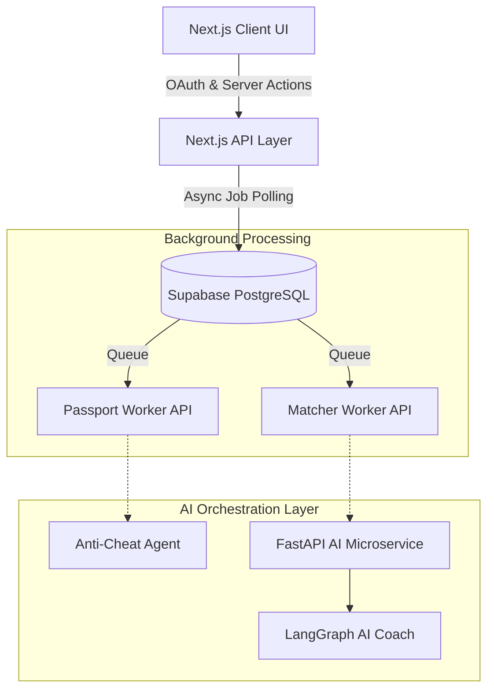

# 🎓 Credify: AI-Driven Verifiable Skill Passport

**Credify** is a next-generation career identity platform built for the **Smart India Hackathon (SIH)**. It bridges the gap between fragmented academic credentials and industry requirements by generating cryptographically secure, AI-verified "Skill Passports." 

By connecting their GitHub profiles and uploading PDF certificates, users receive a verifiable portfolio. Our **Dual-Layer AI Orchestration Engine** then evaluates evidence integrity to prevent cheating, matches candidates to live job opportunities, and generates real-time AI roadmaps to close their skill gaps.

---

## 🌟 Key Features

* **🛡️ AI Anti-Cheat Verification (GitProof)**: Evaluates GitHub repositories to detect cloned projects, low-effort forks, or boilerplate code using structured LLM evaluations, ensuring high integrity of all verified skills.
* **Multi-Model Anti-Cheat Ensemble**: Repository integrity is decided by majority vote across three models from three different labs (`openai/gpt-4o-mini`, `google/gemini-2.0-flash`, `deepseek/deepseek-chat`). Model-supplied status labels are discarded and derived from a normalised score, because capability probing found models that contradicted their own scores. A tie, or fewer than two responses, resolves to `pending` rather than guessing. Every individual vote is stored on the repository row and surfaced in the audit console.
* **🔐 Cryptographic Certificate Proof**: Every accepted certificate is fingerprinted server-side with a SHA-256 digest of the stored file bytes (`src/lib/crypto/certificate-proof.ts`), plus a deterministic issuer DID. Hosted badges (Credly / Open Badge) are committed to their canonical URL.
* **⚡ Background AI Queuing**: Employs an asynchronous state-machine architecture to process heavy AI tasks without hitting serverless (Vercel) timeouts.
* **🧠 Multi-Agent Orchestration**: Uses a deterministic LangGraph state machine and AICredits' high-performance OpenAI-compatible proxy to extract skills and match them semantically to industry requirements.
* **💼 Deterministic Opportunity Matching**: Scores a candidate's verified Skill Passport against role profiles built for the Indian market, comparing canonical skill IDs rather than keywords. Role profiles are AI-generated from the candidate's goal and verified skills; Credify does not currently ingest live job-board listings.
* **🎨 Premium Glassmorphic UI**: Built with Next.js 14 and Framer Motion for a stunning, responsive, and deeply interactive user experience.

---

## 🏗️ Enterprise Architecture 

Credify operates on a robust, decoupled architecture separating a high-performance Next.js Edge UI from a heavyweight Python AI backend, connected via asynchronous background workers and a PostgreSQL database.



### 1. Asynchronous Background Workers
To handle long-running AI tasks and prevent serverless function timeouts (like Vercel's strict 10-second limit), Credify utilizes a robust state-machine queue system:
* **`passport_jobs` and `match_jobs`**: Supabase tables that track the lifecycle (`pending`, `processing`, `completed`, `failed`) of heavy AI extractions.
* **Non-Blocking UI**: The frontend polls these job tables in real-time, displaying beautiful progress indicators to the user while the heavy lifting happens invisibly in the background.

### 2. Live Anti-Cheat & Evidence Verification
Instead of blindly trusting resumes, Credify acts as a strict technical recruiter:
* **Next.js Native OAuth**: Securely connects directly to GitHub to fetch raw repository metadata, languages, and README snippets.
* **Anti-Cheat Agent**: Uses `@vercel/ai` and structured `zod` schemas to evaluate repositories in real-time. It flags low-effort clones or boilerplate code, ensuring only authentic, hard-earned skills make it to the Skill Passport.

### 3. Pure Stateless AI Microservice (Python + Node AI Core)
The backend acts purely as a stateless orchestration engine:
* **The Extractor Node**: Ingests unstructured data (PDF certificates) and uses **AICredits (gpt-4o)** to extract deterministic JSON arrays of verifiable skills.
* **The Matcher Node (AI Coach)**: Employs a custom, ultra-fast `vector-store.ts` for in-memory cosine similarity, cross-referencing extracted skills against live industry job requirements without relying on heavy external vector databases.

---

## 🗄️ Database Schema Overview (Supabase PostgreSQL)

Credify relies on a strictly relational schema secured by Row Level Security (RLS):

* **`profiles`**: Stores core user data including gender, degree, and career goals.
* **`passports` & `skills`**: Stores the user's generated passport snapshots and canonical skill mapping.
* **`github_connections` & `github_repos`**: Stores OAuth metadata and repository stats (stars, size, language).
* **`evidence` & `evidence_claims`**: Ties every verified skill back to an immutable source (a specific GitHub repo or uploaded certificate).

---

## 💻 Tech Stack

* **Frontend**: [Next.js 14](https://nextjs.org/) (App Router), TypeScript, Tailwind CSS, shadcn/ui, Framer Motion
* **AI Orchestration Backend**: Python 3.11, [FastAPI](https://fastapi.tiangolo.com/), Node AI Core (`@ai-sdk/openai`)
* **AI Providers**: AICredits (gpt-4o) for rapid Extraction & Matching, Google GenAI fallback.
* **Database & Auth**: [Supabase](https://supabase.com/) (PostgreSQL + RLS)

---

## 🚀 Getting Started (Local Development)

### 1. Clone the Repository
```bash
git clone https://github.com/Credo-Organization/credo2.git
cd credo2
```

### 2. Configure the Frontend (Next.js)

Navigate to the project root and install dependencies:
```bash
npm install
```

Create a `.env.local` file in the root directory and add the following keys:
```env
# Database Config
NEXT_PUBLIC_SUPABASE_URL=your_supabase_url
NEXT_PUBLIC_SUPABASE_ANON_KEY=your_supabase_anon_key
SUPABASE_SERVICE_ROLE_KEY=your_service_role_key

# GitHub OAuth Integration
GITHUB_CLIENT_ID=your_github_client_id
GITHUB_CLIENT_SECRET=your_github_client_secret
NEXT_PUBLIC_APP_URL=http://localhost:3000

# AI Configuration (AICredits Integration)
OPENAI_API_KEY=your_aicredits_key_here
```

### 3. Apply the Database Schema

Run `supabase-schema.sql` in the Supabase SQL editor to create the base tables, then apply the migration:

```bash
scripts/fix-profiles-schema.sql
```

This is **required**, not optional. It adds `gender`, `avatar_url` and `experience_level` to `profiles`, adds `sha256_hash` and `issuer_did` to `certificates`, and backfills `onboarding_completed` into Supabase Auth metadata. Without it, profile saves and certificate uploads are rejected by Postgres.

### 4. Run the Frontend

```bash
npm run dev
```
The frontend will be available at `http://localhost:3000`.

### 5. Configure the AI Microservice (FastAPI)

Open a **new terminal tab** and navigate to the backend directory:
```bash
cd backend
python -m venv venv
source venv/Scripts/activate  # On Windows: venv\Scripts\activate
pip install -r requirements.txt
```

Create a `.env` file inside the `/backend` directory:
```env
OPENAI_API_KEY=your_aicredits_key_here
SUPABASE_URL=your_supabase_url
SUPABASE_KEY=your_supabase_service_role_key
```

Start the Python backend:
```bash
uvicorn main:app --host 0.0.0.0 --port 8000 --reload
```
The backend API will run on `http://localhost:8000`.

---
*Designed & Engineered for the Smart India Hackathon.*
