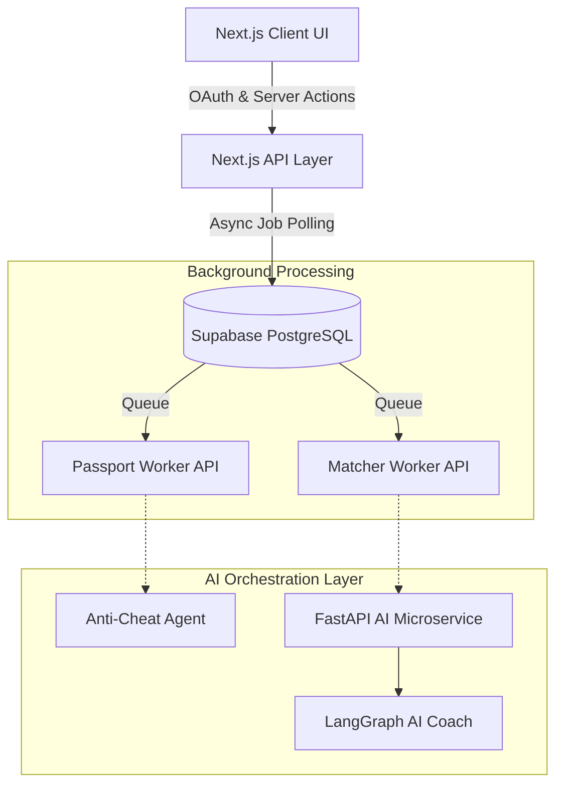

# 🎓 Credify: AI-Driven Verifiable Skill Passport

**Credify** is a next-generation career identity platform built for the **Smart India Hackathon (SIH)**. It bridges the gap between fragmented academic credentials and industry requirements by generating cryptographically secure, AI-verified "Skill Passports." 

By connecting their GitHub profiles and uploading PDF certificates, users receive a verifiable portfolio. Our **Dual-Layer AI Orchestration Engine** then evaluates evidence integrity to prevent cheating, matches candidates to live job opportunities, and generates real-time AI roadmaps to close their skill gaps.

---

## 🌟 Key Features

* **🛡️ AI Anti-Cheat Verification**: Evaluates GitHub repositories to detect cloned projects, low-effort forks, or boilerplate code using structured LLM evaluations, ensuring high integrity of all verified skills.
* **⚡ Background AI Queuing**: Employs an asynchronous state-machine architecture to process heavy AI tasks without hitting serverless (Vercel) timeouts.
* **🧠 Multi-Agent Orchestration**: Uses a deterministic LangGraph state machine to extract skills and match them semantically to industry requirements.
* **💼 Real-Time Opportunity Matching**: Uses custom in-memory vector embeddings (cosine similarity) to match a candidate's verified skill passport against real-world job taxonomy.
* **🎨 Premium Glassmorphic UI**: Built with Next.js 14 and Framer Motion for a stunning, responsive, and deeply interactive user experience.

---

## 🏗️ Enterprise Architecture 

Credify operates on a robust, decoupled architecture separating a high-performance Next.js Edge UI from a heavyweight Python AI backend, connected via asynchronous background workers and a PostgreSQL database.



### 1. Asynchronous Background Workers
To handle long-running AI tasks and prevent serverless function timeouts (like Vercel's strict 10-second limit), Credify utilizes a robust state-machine queue system:
* **`passport_jobs` and `match_jobs`**: Supabase tables that track the lifecycle (`pending`, `processing`, `completed`, `failed`) of heavy AI extractions.
* **Non-Blocking UI**: The frontend polls these job tables in real-time, displaying beautiful progress indicators to the user while the heavy lifting happens invisibly in the background.

### 2. Live Anti-Cheat & Evidence Verification
Instead of blindly trusting resumes, Credify acts as a strict technical recruiter:
* **Next.js Native OAuth**: Securely connects directly to GitHub to fetch raw repository metadata, languages, and README snippets.
* **Anti-Cheat Agent**: Uses `@vercel/ai` and structured `zod` schemas to evaluate repositories in real-time. It flags low-effort clones or boilerplate code, ensuring only authentic, hard-earned skills make it to the Skill Passport.

### 3. Pure Stateless AI Microservice (Python + LangGraph)
The Python backend (`backend/main.py`) acts purely as a stateless orchestration engine:
* **The Extractor Node**: Ingests unstructured data (PDF certificates) and uses **Gemini 2.5 Flash** to extract deterministic JSON arrays of verifiable skills.
* **The Matcher Node (AI Coach)**: Employs a custom, ultra-fast `vector-store.ts` for in-memory cosine similarity, cross-referencing extracted skills against live industry job requirements without relying on heavy external vector databases.

---

## 🗄️ Database Schema Overview (Supabase PostgreSQL)

Credify relies on a strictly relational schema secured by Row Level Security (RLS):

* **`passports` & `skills`**: Stores the user's generated passport snapshots and canonical skill mapping.
* **`github_connections` & `github_repos`**: Stores OAuth metadata and repository stats (stars, size, language).
* **`evidence` & `evidence_claims`**: Ties every verified skill back to an immutable source (a specific GitHub repo or uploaded certificate).
* **`passport_jobs` & `match_jobs`**: The async task queues that the Next.js API polling workers rely upon.

---

## 💻 Tech Stack

* **Frontend**: [Next.js 14](https://nextjs.org/) (App Router), TypeScript, Tailwind CSS, shadcn/ui, Framer Motion
* **AI Orchestration Backend**: Python 3.11, [FastAPI](https://fastapi.tiangolo.com/), [LangGraph](https://langchain-ai.github.io/langgraph/)
* **AI SDKs**: Vercel AI SDK (`@vercel/ai`) for Anti-Cheat, Google GenAI SDK for Extractor
* **Database & Auth**: [Supabase](https://supabase.com/) (PostgreSQL + RLS)

---

## 🚀 Getting Started (Local Development)

### 1. Clone the Repository
```bash
git clone https://github.com/Credo-Organization/credo2.git
cd credo2
```

### 2. Configure the Frontend (Next.js)

Navigate to the project root and install dependencies:
```bash
npm install
```

Create a `.env.local` file in the root directory and add the following keys:
```env
# Database Config
NEXT_PUBLIC_SUPABASE_URL=your_supabase_url
NEXT_PUBLIC_SUPABASE_ANON_KEY=your_supabase_anon_key
SUPABASE_SERVICE_ROLE_KEY=your_service_role_key # Used for backend administrative tasks

# GitHub OAuth Integration
GITHUB_CLIENT_ID=your_github_client_id
GITHUB_CLIENT_SECRET=your_github_client_secret
NEXT_PUBLIC_APP_URL=http://localhost:3000

# AI Configuration (Anti-Cheat / Fast Embeddings)
XAI_API_KEY=your_xai_api_key
```

Run the database migrations to set up the background queues and tables:
```bash
node scripts/migrate.js
```

Start the frontend development server:
```bash
npm run dev
```
The frontend will be available at `http://localhost:3000`.

### 3. Configure the AI Microservice (FastAPI)

Open a **new terminal tab** and navigate to the backend directory:
```bash
cd backend
python -m venv venv
source venv/Scripts/activate  # On Windows: venv\Scripts\activate
pip install -r requirements.txt
```

Create a `.env` file inside the `/backend` directory:
```env
GEMINI_API_KEY=your_gemini_api_key
SUPABASE_URL=your_supabase_url
SUPABASE_KEY=your_supabase_service_role_key
```

Start the Python backend:
```bash
uvicorn main:app --host 0.0.0.0 --port 8000 --reload
```
The backend API will run on `http://localhost:8000`.

---
*Designed & Engineered for the Smart India Hackathon.*
