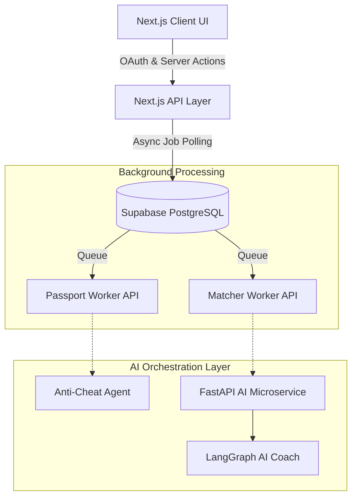

# Credify: AI-Driven Verifiable Skill Passport

Credify is a next-generation career identity platform designed to bridge the gap between academic credentials and industry requirements. By seamlessly generating cryptographically secure, AI-verified "Skill Passports," Credify empowers students and professionals to showcase their authentic capabilities. 

By connecting GitHub profiles and uploading certificates, users receive a verifiable portfolio. Our **Dual-Layer AI Orchestration Engine** then automatically evaluates evidence integrity, matches candidates to live job opportunities, and generates real-time AI roadmaps to close their skill gaps.

---

## 🏗️ Enterprise Architecture 

Credify operates on a robust, decoupled architecture separating a high-performance Next.js Edge UI from a heavyweight Python AI backend, connected via asynchronous background workers.



### 1. Asynchronous Background Workers
To handle long-running AI tasks and prevent serverless function timeouts (like Vercel's 10-second limit), Credify utilizes a robust state-machine queue system:
* **`passport_jobs` and `match_jobs`**: Supabase tables that track the lifecycle (`pending`, `processing`, `completed`, `failed`) of heavy AI extractions.
* **Non-Blocking UI**: The frontend polls these job tables in real-time, displaying beautiful progress indicators to the user while the heavy lifting happens invisibly in the background.

### 2. Live Anti-Cheat & Evidence Verification
Instead of blindly trusting resumes, Credify acts as a strict technical recruiter:
* **Next.js Native OAuth**: Securely connects directly to GitHub to fetch raw repository metadata, languages, and README snippets.
* **Anti-Cheat Agent**: Uses `@vercel/ai` and structured `zod` schemas to evaluate repositories in real-time. It flags low-effort clones or boilerplate code, ensuring only authentic, hard-earned skills make it to the Skill Passport.

### 3. Pure Stateless AI Microservice (Python + LangGraph)
The Python backend (`backend/main.py`) has been stripped of complex auth middleware, acting purely as an orchestration engine:
* **The Extractor Node**: Ingests unstructured data (PDF certificates, GitHub repos) and uses **Gemini 2.5 Flash** (or xAI models) to extract deterministic JSON arrays of verifiable skills.
* **The Matcher Node (AI Coach)**: Employs a custom, ultra-fast `vector-store.ts` for in-memory cosine similarity, cross-referencing extracted skills against live industry job requirements without relying on heavy external vector databases.

---

## 💻 Tech Stack

* **Frontend**: [Next.js 14](https://nextjs.org/) (App Router), TypeScript, Tailwind CSS, shadcn/ui, Framer Motion
* **AI Orchestration Backend**: Python 3.11, [FastAPI](https://fastapi.tiangolo.com/), [LangGraph](https://langchain-ai.github.io/langgraph/)
* **AI SDKs**: Vercel AI SDK (`@vercel/ai`)
* **Database & Auth**: [Supabase](https://supabase.com/) (PostgreSQL + RLS)

---

## 🚀 Getting Started (Local Development)

### 1. Start the Next.js Frontend
```bash
git clone https://github.com/Credo-Organization/credo2.git
cd credo2
npm install
```

Configure your `.env.local` file:
```env
NEXT_PUBLIC_SUPABASE_URL=your_supabase_url
NEXT_PUBLIC_SUPABASE_ANON_KEY=your_supabase_anon_key

# GitHub OAuth Integration
GITHUB_CLIENT_ID=your_github_client_id
GITHUB_CLIENT_SECRET=your_github_client_secret
NEXT_PUBLIC_APP_URL=http://localhost:3000

# AI Configuration
XAI_API_KEY=your_xai_api_key
```

Run the database migrations to set up the background queues:
```bash
node scripts/migrate.js
npm run dev
```

### 2. Start the FastAPI Backend
```bash
# In a new terminal tab
cd backend
python -m venv venv
source venv/Scripts/activate  # On Windows
pip install -r requirements.txt
```

Ensure your `backend/.env` has `GEMINI_API_KEY` set.
```bash
uvicorn main:app --host 0.0.0.0 --port 8000 --reload
```
