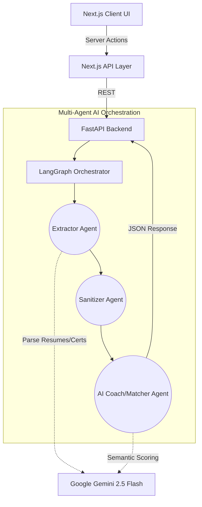

# Credify: AI-Driven Verifiable Skill Passport 🚀

Credify is a next-generation career identity platform built for the **Smart India Hackathon (SIH)**. It bridges the gap between academic credentials and industry requirements by generating cryptographically secure, AI-verified "Skill Passports." 

By connecting their GitHub and uploading certificates, students receive a verifiable portfolio. Our **Multi-Agent Python Engine** then automatically matches them to live job opportunities and generates real-time AI roadmaps to close their skill gaps.

---

## 🧠 Enterprise AI Architecture (LangGraph & Gemini)

Credify operates on a decoupled architecture, separating the high-performance Next.js UI from a heavyweight Python orchestration backend.



### 1. Multi-Agent Orchestration (Python + LangGraph)
Instead of fragile, single-shot API calls, Credify uses a deterministic state graph:
* **The Extractor Node**: Ingests unstructured data (GitHub repos, PDF certificates, LinkedIn profiles) and uses **Gemini 2.5 Flash** to extract deterministic JSON arrays of verifiable skills.
* **The Matcher Node (AI Coach)**: Cross-references the extracted canonical skills against live industry job requirements to compute semantic compatibility scores and identify missing critical skills.

### 2. Glassmorphic Frontend Engineering
* **Premium Aesthetics**: Built with Next.js 14 App Router, utilizing Framer Motion for micro-interactions, staggered entrance animations, and a cohesive glassmorphic design system.
* **Bulletproof Demo State**: Implements robust Next.js Error Boundaries (`error.tsx`, `global-error.tsx`) to gracefully catch API timeouts during live pitches, rendering a beautiful "System Glitch" UI rather than crashing.
* **Streaming AI UI**: Uses the `@ai-sdk/react` to stream personalized career timelines directly to the UI, bypassing serverless timeout limitations.

### 3. Database Security & Scalability
* **Supabase PostgreSQL**: Fully integrated with custom tables for `passports`, `skills`, and `user_skills`.
* **Row Level Security (RLS)**: Strictly enforced backend policies guarantee that users can only insert or modify evidence claims that belong to their cryptographically signed profile.

---

## 💻 Tech Stack

* **Frontend**: [Next.js 14](https://nextjs.org/) (App Router), TypeScript, Tailwind CSS, shadcn/ui, Framer Motion
* **AI Orchestration Backend**: Python 3.11, [FastAPI](https://fastapi.tiangolo.com/), [LangGraph](https://langchain-ai.github.io/langgraph/)
* **AI Models**: Google Gemini 2.5 Flash (via `@google/genai`)
* **Database & Auth**: [Supabase](https://supabase.com/)

---

## 🏆 Hackathon Demo Survival Guide

For the live SIH pitch, we have included a flawless demo environment seeder to prevent manual data entry.

1. Open your **Supabase Dashboard** -> **SQL Editor**.
2. Open `scripts/seed-demo-data.sql` from this repository.
3. Paste the contents into the SQL Editor and click **Run**.
4. The database is now populated with a perfect "Aman Kumar" student profile, 5 verified skills, a published Passport, and 2 mock jobs—ready for an instant demo.

---

## 🚀 Getting Started (Local Development)

### 1. Start the Frontend
```bash
git clone https://github.com/Credo-Organization/credo2.git
cd credo2
npm install
```
Populate your `.env` file (see `.env.example`).
```bash
npm run dev
```

### 2. Start the AI Backend
```bash
# In a new terminal tab
cd backend
python -m venv venv
source venv/Scripts/activate  # On Windows
pip install -r requirements.txt
```
Ensure your `backend/.env` has `GEMINI_API_KEY` set.
```bash
python -m uvicorn main:app --host 0.0.0.0 --port 8000 --reload
```

---
*Designed & Engineered by top elite frontend and AI engineers for SIH.*
